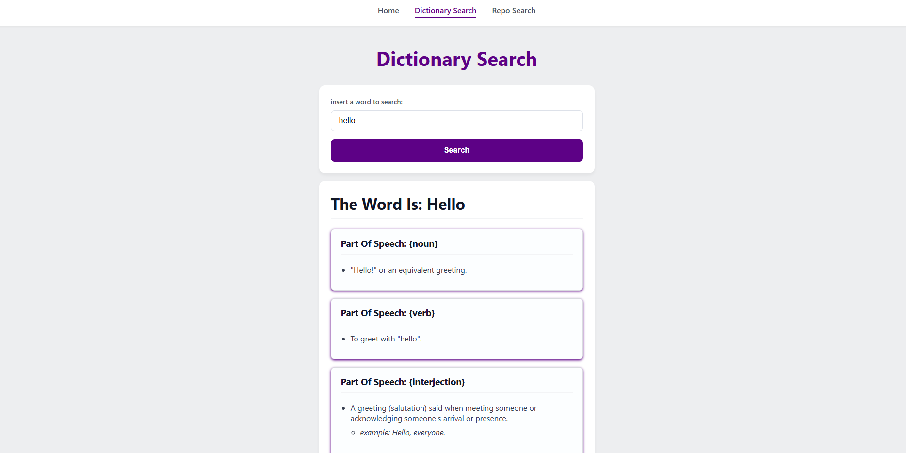
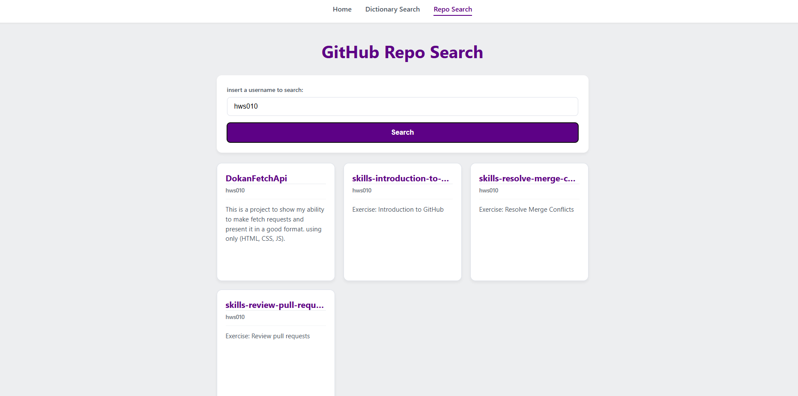
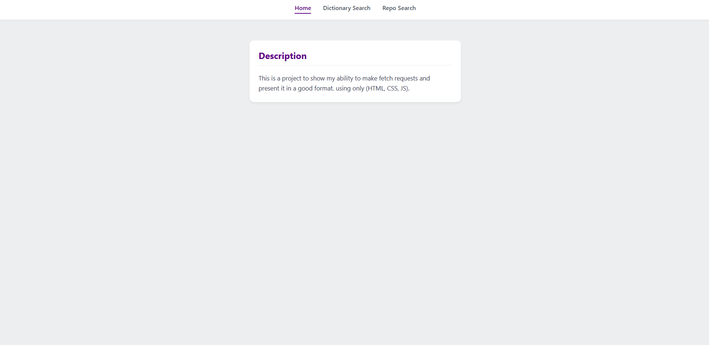

# DokanFetchApi
This is a project to show my ability to make fetch requests and present it in a good format. using only (HTML, CSS, JS).

## Tools used to create
- VScode
- PostMan to view and understand the structure of results

## Project Plan:
The plan is to make a 3 pages website.
### Page 1 (index):
In this page there should a description of the project and a nav for the other pages.
### Page 2 (dictionary Search):
This page should have a search bar that would allow the user to search a word and will display information returned from the api
### Page 3 (GitHub Repo Search):
This page should have a search bar that would allow the user to search a GitHub username and it will display the repos under that account in a clean way.
### All Pages Must Handle Errors and Show Loading State

## Page 2, The Dictionary Search Page Explained:
### HTML:
created a simple search container that would hold the search elements (label, input field, search button) each with it class for styling and the button has an onclick event where it would create the fetch url and send it to the search function. and an empty container that would hold the fetch result's when the fetch is successful or an error message if not.
### JS:
- the JS first start with the search function that would check if the user inputted any value or submitted an empty string if it was empty an error message would appear instructing the user to input a word to search. if a word was inputted a getData is called and passing the url as an argument.
- getData is async function which allows the use of fetch and promises so we send a fetch request and then checking the response status to see if there was any mistakes in the case of a 404 that means no word was found so an error is thrown. in the case of anything other than ok which is any 200 status an error would be thrown for a server problem.
- after the results are retrieved and stored in a JSON object/array now the website can start generating and injecting elements into the DOM.
- a foreach loop is used to enumerate through the array starting with printing the part of speech in a h3 then listing each definition under it and checking for example to add to the elements.
- after adding each part of speech and definitions and examples then it would be injected at once in the end
#### How Is The HTML Stored And Injected?:
In the for each we are adding the elements in a "HtmlElemnts" variable that we are injecting into the "resultContainer.innerHTML" at the end of the execution.
### Page Image:


## Page 3, The GITHUB Repo Search Page Explained:
### HTML:
The HTML for this page is similar to the "Dictionary Page" with an addition of a status card instead of printing errors and instructions in the result container here it has its own card and using the same search container as the "Dictionary Page".
### JS:
- the JS first start with the search function that would check if the user inputted any value or submitted an empty string if it was empty an error message would appear instructing the user to input a username to search. if a username was inputted a getData is called and passing the url as an argument.
- getData would first start the fetch request and check for the status checking first for 404 incase of user not found then checking for 403 since there is a rate limit for requests and than checking for anything other than ok status. each would throw an error that would tell the user what is the problem
- after getting the main JSON it has links for each specific thing we want from the user repositories, follower, following etc.. in our case we are focusing on the repositories so we are getting the links from the JSON and sending it to another functions "getElements(element)" that would take the link and return the result in a JSON format.
- after getting the repo result we are sending it to a "cardGenerator(repos)" function that will start enumerating through the JSON and printing the elements that would form the card and storing it in "HtmlElemnts" variable
- after the function finishes executing and all the cards are stored in "HtmlElemnts" we return to the main function to inject the "HtmlElemnts" in the DOM.
### Page Image:


## Page 1, Index Page and CSS
### Index Page:
After making both pages and creating the index i added the nav bar for each page which is a simple nav bar with responsive that would highlight the current page with a diffrent color by checking if its active or not.
### CSS Overview
for the general layout i styled the body to use flex display and center all elements in the middle and stack all elements vertically. for the theme I went with bright colors with a purple touch and some shadows. and made sure that the pages would look clean on a phone by checking the screen pixel size and adjusting some elements accordingly. check containers if they are empty to make the invisible until they are filled with data. 
### Page Image:



## SQL Schema For Storing Searches
```
CREATE TABLE saved_searches (
    id SERIAL PRIMARY KEY,
    user_id INT NOT NULL,
    search_query VARCHAR(255) NOT NULL,
    created_at TIMESTAMP DEFAULT CURRENT_TIMESTAMP,
    FOREIGN KEY (user_id) REFERENCES users(id)
);
```
In this table there would be the "id" of the Search which is the main identifier. and a "user_id" that must be set so each search would have an owner. and then the search string is stored in "search_query" and the time of creation as "created_at" and then we are connecting the "user_id" which is a foreign key with the "id" from the users table.
